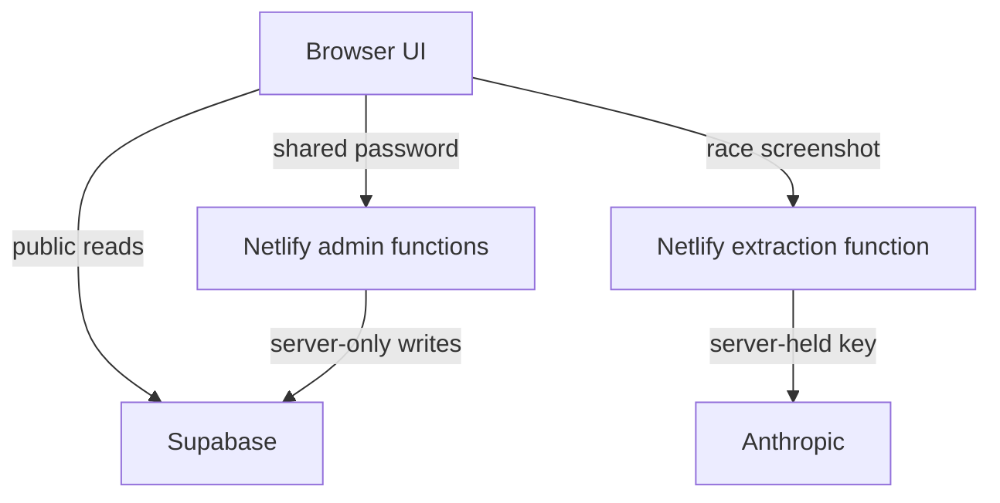

# SimR architecture

## Scope

SimR is an Assetto Corsa league application. The existing Forza database rows are left intact, but the application is configured to one AC series through `VITE_AC_SERIES_ID`. Championship scoring remains independent from future driver skill ratings.

## Sources of truth

| Concern | Source of truth |
| --- | --- |
| Database shape | Supabase public schema |
| Finishing-position points, DNF points, multipliers | `src/domain/scoring.js` |
| Driver efficiency grades | `src/domain/classification.js` |
| Public data access | `src/api/supabase.js` |
| Admin session and mutations | Netlify admin functions |
| Screenshot extraction | Netlify `extract-results` function |
| UI orchestration during migration | `src/app.js` |

No page is allowed to implement its own points multiplier, DNF points rule, drop-round selection, or grade threshold logic. Pages may aggregate the output of domain functions for display.

## Runtime boundaries

The Supabase publishable key is expected in the browser. The server secret key, shared admin password, session signing secret, and Anthropic key must never have a `VITE_` prefix or appear in frontend files.

## Current migration boundary

The original single-file interface still contains inline event attributes and a large `src/app.js`. The structured project exposes a temporary compatibility surface on `window` so behavior can be moved one feature at a time without a rewrite. New code should not add to that surface.

The next extraction slices should be:

1. career statistics;
2. standings aggregation;
3. event and session repository functions;
4. page controllers/components;
5. removal of inline event attributes and the compatibility surface.

TrueSkill belongs in a separate `ratings` domain after historical replay rules are agreed. It must not alter championship scoring or current efficiency grades during evaluation.
